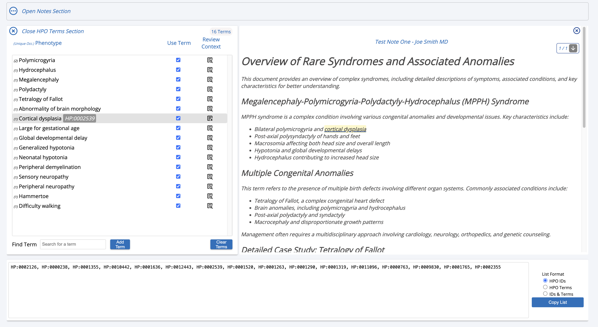
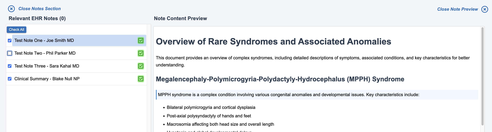
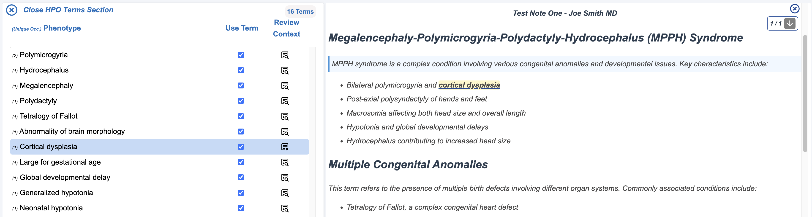
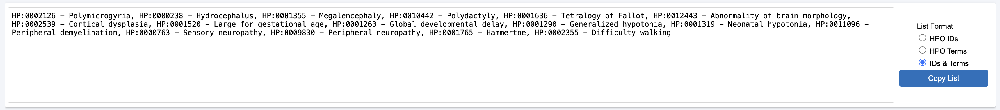

# Pheno-Plus

Pheno-Plus is a SMART on FHIR application designed to streamline phenotype extraction from electronic health records (EHR). It enables users to select relevant clinical notes, extract phenotype terms using ClinPhen, review terms in context, and curate a final phenotype list in multiple formats.



## Features

- **EHR integration** — embeds in the clinical chart via SMART on FHIR
- **Flexible note selection** — choose which clinical notes to analyze
- **Automated extraction** — ClinPhen NLP identifies phenotype terms
- **Contextual review** — terms shown in original note text
- **Interactive curation** — unselect non-relevant terms before finalizing
- **Export** — copy the final phenotype list in multiple formats

## How it works

1. **Select notes** — choose relevant clinical notes within the EHR.



2. **Extract phenotypes** — ClinPhen parses notes and identifies phenotype terms.

3. **Review and filter** — see extracted terms in context; remove irrelevant ones.



4. **Copy and export** — copy the finalized list in the format you need.



## Automated tests

Vitest unit and integration tests run without Epic or SMART OAuth. See [docs/testing.md](./docs/testing.md) for a walkthrough of the example tests.

```bash
npm test
```

## Local install (standalone app)

1. **Install dependencies**

```bash
npm install
```

2. **Configure the app**

```bash
npm run setup:config
```

This creates `public/deploymentConfig.json` and `public/whiteList.json` from templates if they are missing. No edits are required for local development.

3. **Start the dev server**

```bash
npm run dev
```

Vite serves the app at [http://localhost:3002](http://localhost:3002) (default port). Dummy notes are loaded from `fixtures/dummyNotes.json` via a dev-only route (not included in production builds).

4. **Open the app**

Browse to the dev server URL above.

On `localhost`, `deploymentConfig.json` resolves to the **`local`** environment: SMART OAuth is skipped (`bypassFHIR: true`) and notes come from fixtures, not the EHR.

## Staging / production install (EHR integrated)

1. **Install dependencies**

```bash
npm install
```

2. **Configure the app**

```bash
npm run setup:config
```

Edit `public/deploymentConfig.json`:

- Add each deployment **hostname** under `hosts` and point it at `staging` or `production` under `environments`.
- Set `clientId` and `redirectUri` for each environment to match your EHR SMART app registration.
- Leave `bypassFHIR` **false** for staging and production (only `local` should use dummy notes).
- Set `enforceWhiteList` and fill in `public/whiteList.json` if you restrict access by Epic user ID.

See [Configuration](#configuration) for field details.

3. **Set the launch path for each environment**

In `package.json`, set `--base` on each build script to the URL path where that copy of the app will be hosted (must match the EHR redirect URL and web server layout). See [Launch paths](#launch-paths).

4. **Build for the target environment**

```bash
npm run build:staging
```

or

```bash
npm run build:production
```

`npm run build` is an alias for `build:production`. Each command runs `setup:config` and writes a deployment-ready **`dist/`** directory: `index.html`, bundled JS/CSS under `dist/assets/`, static files from `public/` (config, `mini_hpo.db`, `sql-wasm.wasm`, etc.).

5. **Deploy to the web server**

Copy the **contents** of `dist/` to the server directory that matches that build’s `base` (same path prefix Epic uses to launch the app). Ensure `deploymentConfig.json` and `whiteList.json` are present beside `index.html`.

6. **Launch from the EHR**

Open Pheno+ from the SMART app launcher in the EHR on the configured host. The app runs OAuth against Epic, fetches live clinical notes via FHIR, and calls the ClinPhen extraction service.

There is no local substitute for this path — `npm run dev` and `vite preview` always resolve as `localhost` with the `local` environment.

## Configuration

Runtime config files live in `public/` and are copied into `dist/` at build time. Templates live in `config/templates/` and are never deployed.

| Template (`config/templates/`) | Runtime file (`public/`) | Purpose |
|--------------------------------|--------------------------|---------|
| `deploymentConfig.example.json` | `deploymentConfig.json` | Host mapping, OAuth, feature flags |
| `whiteList.example.json` | `whiteList.json` | Allowed users when whitelist is enforced |

Dummy notes for local dev live in `fixtures/dummyNotes.json` — served by the Vite dev server only, not included in staging or production builds.

`setup:config` copies each template into `public/` **only if the target file is missing** — it never overwrites an existing file.

### `deploymentConfig.json`

One gitignored file holds all environments. At runtime, the browser **hostname** selects the active row via `hosts` → `environments`:


| Flag | Meaning |
|------|---------|
| `bypassFHIR` | Skip SMART OAuth and load dummy notes (local dev only) |
| `enforceWhiteList` | When true, user must appear in `whiteList.json` after OAuth |
| `clientId` / `redirectUri` | Epic SMART app credentials for this deployment |

Fill in `environments.staging` and `environments.production` with your real Epic values after running `setup:config`.

### `whiteList.json`

Used when `enforceWhiteList` is true. Keys are Epic user IDs; values are display names.

## Launch paths

A SMART on FHIR app is opened from a **URL on your web server** — the path where `index.html` is served (for example `/launch/` or `/myapp/oauth2/redirect/`). **Different deployments often use different launch paths** because of EHR app registration, reverse-proxy layout, or separate staging vs production installs. The browser must load JS, CSS, and other static assets under that same path prefix.

### Runtime config (one build artifact, many hosts)

Most settings are resolved **at runtime** and do not require a separate build per host:

- **`deploymentConfig.json`** — a single file in `dist/` can list many hostnames; the browser hostname selects OAuth credentials, `bypassFHIR`, `enforceWhiteList`, and related flags.
- **`whiteList.json`** — fetched with a URL relative to the current page, so it works on any launch path where the app is mounted.

You can deploy the same JSON config files to every environment that shares this app; only the hostname mapping changes behavior.

### Build-time: Vite `base` (one build per launch path)

The exception is Vite’s **`base`** option. It is **baked in at build time** into `index.html`, bundled JS/CSS, and any code that uses `import.meta.env.BASE_URL` (for example `mini_hpo.db` and `sql-wasm.wasm`). If `base` does not match the path where that copy of the app is hosted, those assets will 404.

**Use a separate build for each launch path you deploy to.** You do not need separate JSON config files per path.

### Where to set `base`

Per-environment launch paths are defined in **`package.json`** as `--base` on each build script (and a default in `vite.config.js` for `npm run dev`):

```json
"build:staging": "npm run setup:config && vite build --base /your/staging/launch/path/",
"build:production": "npm run setup:config && vite build --base /your/production/launch/path/"
```

Edit these paths to match your EHR SMART app redirect URLs and server layout. Add more `build:<name>` scripts if you have additional environments. `npm run build` should point at your primary production build.

| Script | Purpose |
|--------|---------|
| `npm run build:<env>` | Production build for one launch path (`--base` in `package.json`) |
| `npm run dev` | Local dev server; default `base` in `vite.config.js` |

Each build runs `setup:config` and writes output to **`dist/`** (gitignored until you build). Deployment steps are in [Staging / production install](#staging--production-install-ehr-integrated) above.
